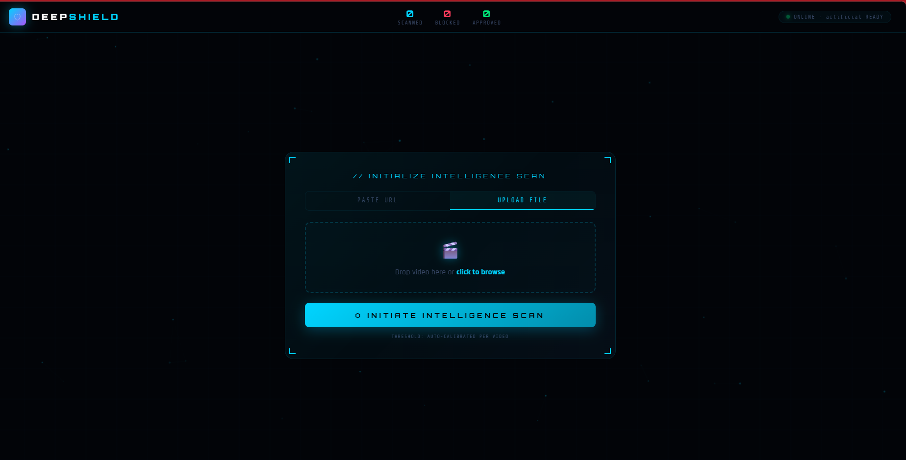

# 🛡 DeepShield v3

> Real-time deepfake and AI-generated video detection — fully local, no paid APIs.

[](https://python.org)
[](https://fastapi.tiangolo.com)

---

## What it does

DeepShield v3 analyzes videos frame-by-frame in real time and detects whether they are AI-generated or deepfaked. Paste a social media link or upload a file — results stream live as the video plays.

- **Deepfake detection** — Vision Transformer model scoring every frame
- **Face tracking** — live bounding boxes with per-face AI confidence
- **Scene intelligence** — object detection, indoor/outdoor classification
- **OCR** — reads on-screen text from each frame
- **Speech transcription** — full transcript with clickable timestamps
- **AI forensic report** — auto-generated verdict with explanation
- **Threat timeline** — clickable bar chart of flagged frames

---

## Demo

<!-- Upload screenshots to a folder called /assets in your repo, then they'll show here -->

| Scanner View | Verdict Panel |
|---|---|
|  |  |

---

## Tech Stack

| Layer | Technology |
|---|---|
| Backend | Python 3.11, FastAPI, WebSocket |
| Deepfake Model | [umm-maybe/AI-image-detector](https://huggingface.co/umm-maybe/AI-image-detector) (ViT) |
| Face Detection | MediaPipe |
| Object Detection | YOLOv8n |
| OCR | EasyOCR |
| Speech | OpenAI Whisper tiny |
| AI Reports | Groq LLM (Llama 3.3 70B) |
| Video Download | yt-dlp (1000+ platforms) |
| Frontend | Vanilla HTML/CSS/JS — single file |

---

## Quick Start

> Requires **Python 3.11** — [download here](https://www.python.org/ftp/python/3.11.9/python-3.11.9-amd64.exe)

```bash
# Clone
git clone https://github.com/vishh007/deepshield.git
cd deepshield

# Create virtual environment
py -3.11 -m venv venv
.\venv\Scripts\Activate.ps1        # Windows
source venv/bin/activate            # Mac/Linux

# Install dependencies
pip install -r requirements.txt

# Download ML models (~500MB, one-time)
cd backend
python download_models.py

# Start
uvicorn main:app --reload --port 8000
```

Open **http://localhost:8000**

---

## Optional — AI Reports

Free Groq API key at [console.groq.com](https://console.groq.com) (no credit card needed).

```bash
$env:GROQ_API_KEY = "gsk_your_key_here"   # Windows
export GROQ_API_KEY="gsk_your_key_here"   # Mac/Linux
```

---

## How It Works

1. Video is uploaded or downloaded via yt-dlp
2. Frames are sampled and scored by the Vision Transformer model
3. Results stream live to the browser over WebSocket
4. Decision engine auto-calibrates thresholds — edited reels vs genuine deepfakes have different score distribution patterns
5. Final verdict — **APPROVED / FLAGGED / BLOCKED** — with a downloadable HTML forensic report

---

*Built for AI4Dev '26 Hackathon — PSG College of Technology*
